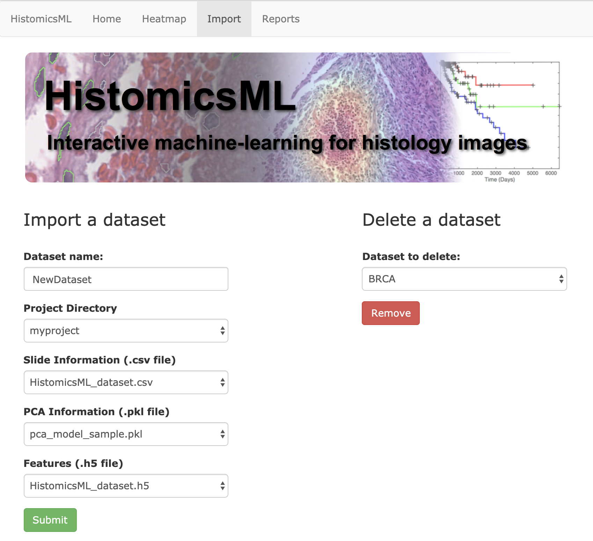

.. highlight:: shell
.. _data-import:

==================
Importing datasets
==================

This section describes the dataset import process and setup of the HistomicsML2 server. Datasets are imported by first committing a dataset at the command line to the database container, and then importing committed datasets through the server container user interface.

.. note:: Superpixel boundary files are large and so these are committed to the database from the command line.

HistomicsML2 datasets should be stored in subdirectories within a single master directory:

.. code-block:: bash

  master/
  |
  |----- myproject1/
      |----- HistomicsML_dataset.h5
      |----- pca_model_sample.pkl
      |----- slide_info.csv
      |----- boundary/
      |----- centroid/
      |----- svs/
      |----- tif/
  |----- myproject2/
      |----- HistomicsML_dataset.h5
      |----- pca_model_sample.pkl
      |----- slide_info.csv
      |----- boundary/
      |----- centroid/
      |----- svs/
      |----- tif/
  .
  .
  .
  |----- classifiers/
  |----- models/
  |----- outputs/

This hierarchy allows all datasets to be easily mounted and accessible by the docker containers.

.. note:: Web server docker container needs a permission to access the directories: ``myproject1``, ``myproject2``, ..., ``classifiers``, so make sure that the directories support a writable permission (e.g. chmod 777 /master/myproject1).

Download the HistomicsML2 containers
-----------------------------------

.. code-block:: bash

  $ docker pull cancerdatascience/histomicsml_db:1.0
  $ docker pull cancerdatascience/histomicsml:1.0

Run the database container and commit datasets
----------------------------------------------

On the local file system, navigate to the master directory then run the database container and setup a network for the server and database containers to communicate over

.. code-block:: bash

  $ cd master
  $ docker network create --subnet=172.18.0.0/16 hmlnet
  $ docker run -d --net hmlnet --ip="172.18.0.5" -t -i -v "$PWD":/"${PWD##*/}" -e MYSQL_ROOT_PASSWORD='pass' -e MYSQL_DATABASE='nuclei' -p 3306:3306 --name hmldb cancerdatascience/histomicsml_db:1.0

Here the -v command mounts the master directory to the path ``/${PWD##*/}`` inside the database docker container.

.. note:: The database and server dockers run Apache and Mysql servers on ports 80 and 3306 respectively.
   Check if these ports are in use before deploying HistomicsML2.

Next, run the database docker container interactively and commit the superpixel boundaries and slide information tables using the script ``import_boundary_slideinformation.sh``

.. code-block:: bash

  $ docker exec -it hmldb bash
  root@cf2213792571:/# ./import_boundary_slideinformation.sh /master/myproject1/slide_info.csv /master/myproject1/boundary
  root@cf2213792571:/# ./import_boundary_slideinformation.sh /master/myproject2/slide_info.csv /master/myproject2/boundary
  ...
  root@cf2213792571:/db# exit

The paths used in these commands reflect their mount location inside the database docker.

(Optional) Copy PCA .pkl file
-----------------------------

If you generated a dataset for inference then you imported a PCA transform during feature extraction. The .pkl file containing this PCA transform needs to be copied into the inference project folder during import. Supposing your training dataset is in myproject1 and your inference dataset is in myproject2

.. code-block:: bash

  $ cp /master/myproject1/training_pca.pkl /master/myproject2

Launch HistomicsML2 and import the datasets
------------------------------------------

Run the server container

.. code-block:: bash

  $ docker run --net hmlnet -i -t -v "$PWD":/datasets -p 80:80 -p 6379:6379 --link hmldb --name hml cancerdatascience/histomicsml:1.0 /bin/bash

Start Redis and Apache, then launch the HistomicsML2 server

.. code-block:: bash

  # Link the dataset directory
  root@5c6eb03c0e2f:/notebooks# ln -s /datasets/classifiers /var/www/html/HistomicsML/trainingsets
  root@5c6eb03c0e2f:/notebooks# ln -s /datasets /var/www/html/HistomicsML/datasets
  # Run redis on server container.
  root@5c6eb03c0e2f:/notebooks# redis-server --daemonize yes
  # Run apache on server container.
  root@5c6eb03c0e2f:/notebooks# service apache2 start
  # Use this command if server has a static IP address available, otherwise skip.
  root@5c6eb03c0e2f:/notebooks# sed -i -e 's/\/localhost/\/Your_Static_IP_Address/g' /var/www/html/HistomicsML/php/hostspecs.php
  # Launch HistomicsML and wait for "Dataset Loaded."
  root@5c6eb03c0e2f:/notebooks# cd /var/www/html/predict-rest-api
  root@5c6eb03c0e2f:/notebooks# python run_model_server.py

.. note:: If the server becomes unresponsive or generates a connection error during use then re-run run_model_server.py.

* Open the web page http://localhost/HistomicsML/data.html
* Enter a dataset name and select your base project directory from ``Project Directory``. The fields for ``Slide Information``, ``PCA Information``, ``Features`` will automatically populate after selecting the project folder. If you have multiple versions of these files in a project folder then these alternative files can be accessed with the list buttons.
* Click Submit to confirm

Next steps
==========

Refer to the :ref:`system overview <system-overview>` to see more details on the roles of the dataset creation, database, and server containers.
