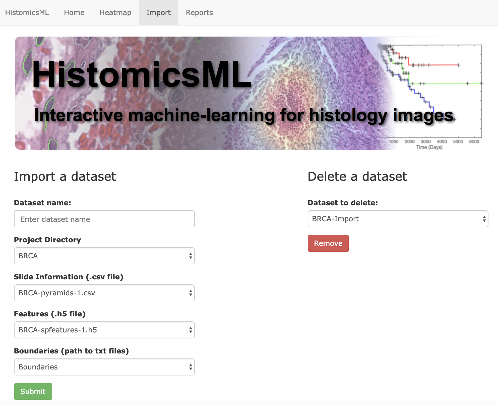

.. highlight:: shell

==============
Importing datasets
==============

A data import interface is provided to help users import new datasests into HistomicsML. This page demonstrates the data import function using the sample data located in the database container.

The whole-slide image and the boundary, feature, and slide information files are located in separate folders on the database container

.. code-block:: bash

  /fastdata/features/BRCA/
  │
  ├── BRCA-boundaries-1.txt
  │
  ├── BRCA-features-1.h5
  │
  └── BRCA-pyramids-1.csv

  /localdata/pyramids/BRCA/
  │
  └── TCGA-3C-AALJ-01Z-00-DX1.svs.dzi.tif

The following steps, the interface is used to import this dataset into this system

1. Create a folder on the container and modify permissions to enable import

.. code-block:: bash

 $ docker exec -t -i hml bash
 root@19cd8ef3e1ec:/# cd /fastdata/features
 root@19cd8ef3e1ec:/fastdata/features# mkdir NewProjectDirectory
 root@19cd8ef3e1ec:/fastdata/features# chmod 777 NewProjectDirectory

3. Copy the sample data to ``NewProjectDirectory``

.. code-block:: bash

  root@19cd8ef3e1ec:/fastdata/features# cd NewProjectDirectory
  root@19cd8ef3e1ec:/fastdata/features/NewProjectDirectory# cp -R ../BRCA/* ./
  # This copies BRCA-boundaries-1.txt, GBM-features-1.h5, BRCA-pyramids-1.csv to NewProjectDirectory
  
4. Import dataset using the web interface

* Open the web page http://localhost/HistomicsML/data.html
* Enter a dataset name and select ``NewProjectDirectory`` from the Project Directory dropdown.
* The remaining fields will automatically populate once the directory is selected.

.. image:: images/import.png

* Click Submit to confirm the import

Now, you can see the new dataset on the main page, http://localhost/HistomicsML.

The import interface can also be used to delete an existing dataset from the system

* To delete the current dataset, go to http://localhost/HistomicsML/data.html and select the current dataset from the dropdown on the top right, and then click Remove button.

See the data formats section for detailed information on HistomicsML-TA data formats.
