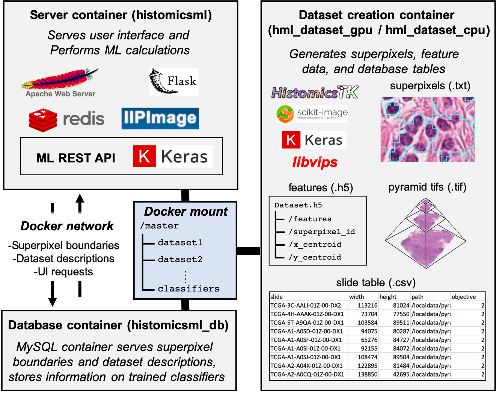

.. highlight:: shell
.. _system-overview:

===============
System overview
===============

Docker images are used to encapsulate the software libraries and dependencies required by HistomicsML2. This enables containers derived from these images to be deployed on a variety of platforms ranging from Macbooks to GPU-enabled linux servers. A graphical overview and description of these containers is provided below. 

Server container
  The server container hosts the user interfaces of HistomicsML2 and performs the machine learning training and inference. Apache serves the UIs with IIPImage enabling navigation of multiresolution whole-slide images inside the web browser. Flask and Keras are used to implement a machine learning REST API so that machine learning models can update as users label data and provide feedback. Redis is used as a data store for user inputs and intermediate results throughout a training session. A GPU-enabled version of the server image is available to accelerate real-time training and prediction.
  
Database container
  The MySQL database container stores superpixel boundaries, information about datasets, and records of training sessions.
  
Dataset creation container
  The dataset creation container allows users to convert their whole-slide images to HistomicsML2 datasets. HistomicsTK, Scikit-image, and Keras are use to perform segmentation and feature extraction on whole-slide images. libvips is used to perform conversion of proprietary whole-slide image formats to pyramidal tifs required by VIPs. A GPU-enabled version of this container is built using the NVIDIA docker to accelerate feature extraction.
  
Docker network
  This network enables communication between the server and database containers. While users navigate whole-slide images the server container renders superpixel boundaries by making requests over the network. Dataset and classifier selection fields are also populated from requests by the server container.
  
Docker mount
  Files from the local file system are mounted inside the docker containers, allowing the containers to consume data and to write results back to permanent storage. A single master folder contains subdirectories for each dataset, and a directory to store trained classifiers. This folder is mounted by all containers.
